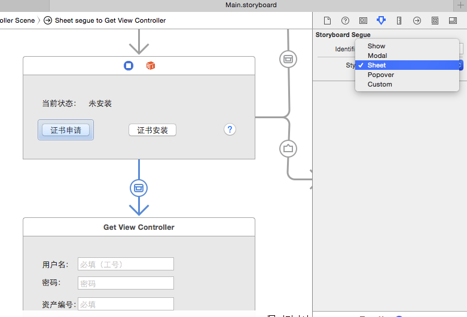

###swift 开发 OS X 程序 （storyboards）

1. 网络请求通过桥接方法使用了 AFNetWorking
2. 涉及到验证pfx 文件的准确性 使用了 chilkat
3. 通过 命令行 完成对pfx 文件的 添加 和 删除 


 直接上图了


* 注意勾选 Use storyboards


  项目建立后会有一个  Main.storyboard 


如图 根据自己的程序设计来添加 ViewController 


编辑好界面后同样 添加  对于的类 （<font color="red">注意去掉 XIB file  的√</font> ）


同样通过拖动版定控件 和 事件 




seuge 同样有多种形式  这里根据需求进行选择 

代码形式进行跳转 并且传递值

```
let installingViewController = self.storyboard?.instantiateControllerWithIdentifier("InstallingViewController") as! InstallingViewController
                var temp = (pwd2.md5() as NSString).substringToIndex(10)
                installingViewController.pwd = temp ;
                installingViewController.down_url = url
                self.presentViewControllerAsSheet(installingViewController)
```


###  开发过程中遇到的问题：

1. NSTextField 的取值和复制

		name = user_name.stringValue
		
		var result = "new name"
		name.stringValue = "\(result)"
		
2. NSViewController 之间传递值 （自定义的 delegate 和 IOS 一样方式 ）

		override func prepareForSegue(segue: NSStoryboardSegue, sender: AnyObject?) {
        	if segue.identifier == "getcert" {
           	 let getViewController = segue.destinationController  as! GetViewController
            	getViewController.delegate = self ;
        	}
   		}

 
 
  3.swift 加载 pfx 方法
  
  		 // 先进行删除操作
        system("security delete-certificate -c ch999 ")
        // 在导入新的pfx 证书
        var command = "security import " + file + " -k ~/Library/Keychains/login.keychain -P " + pwd.uppercaseString
        system(command)

	通过命令行来加载和 删除 pfx 证书
	

